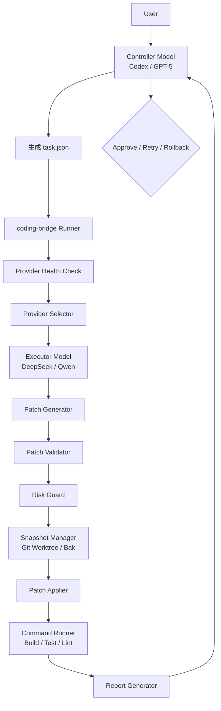

# coding-bridge

> 面向 AI Coding Agent 的安全执行桥接系统

[](https://go.dev/)
[](LICENSE)

**coding-bridge** 是一个开源的安全执行桥接系统，用于让多个大模型在受控、可验证、可回滚的工程环境中协同完成代码修改任务。

它不是简单的模型调用脚本，而是一个具备 **任务事务、模型调度、Patch 校验、Git/Bak 保护、命令执行、测试验证、报告回传、失败恢复、配置管理、审计追踪** 能力的本地自动化工具。

---

## 🎯 为什么需要 coding-bridge？

AI Coding Agent 越来越强大，但直接让模型修改代码存在真实风险：

| 风险 | coding-bridge 的应对 |
|------|---------------------|
| 模型自由发挥修改无关文件 | `allowed_files` 白名单 + Patch Validator 校验 |
| 修改生产配置或密钥文件 | `forbidden_files` 黑名单 + 脱敏规则 |
| 删除文件、执行危险命令 | 高危操作默认禁止 + 命令白名单/黑名单 |
| Patch 应用失败导致代码损坏 | 修改前 Git worktree / Bak 快照保护 |
| 模型输出无法验证 | 只接受 unified diff + 自动构建/测试验证 |
| 执行失败无法恢复 | 完整的状态机 + rollback / recover 机制 |

**核心思路：Controller（Codex 等 AI 工具）分析规划 → coding-bridge 安全执行调度 → Executor（DeepSeek 等低成本模型）生成 patch。coding-bridge 本身只需 Executor 的 API Key。**

## 当前实现状态

目前已经形成首个可验证执行闭环：

- 只收集 `allowed_files`，默认过滤敏感文件，并限制发送给 Executor 的上下文总量
- Executor 请求会使用任务指定的模型，并记录 prompt/completion token 用量
- Patch 会校验文件范围、路径逃逸、hunk 上下文和行数
- 干净 Git 项目在独立 worktree 中执行；脏工作区和非 Git 项目使用 Bak 快照
- 任一步骤失败都会生成报告；构建或测试失败会自动回滚
- `config validate`、`status`、`report`、`rollback` 已连接真实数据

仍在开发：Secret Scanner、审计日志、锁与崩溃恢复、Provider benchmark、MCP Server。

---

## 🏗️ 架构



## 📁 项目结构

```
coding-bridge/
├── cmd/coding-bridge/main.go          # 程序入口
├── internal/
│   ├── providers/                     # 🔌 Provider 层
│   │   ├── provider.go                #   Provider 统一接口
│   │   ├── registry.go                #   注册中心（可插拔架构）
│   │   ├── openai_compatible.go       #   OpenAI 兼容通用基座
│   │   ├── codex.go                   #   Codex Provider
│   │   ├── deepseek.go                #   DeepSeek Provider
│   │   └── health.go                  #   健康检测 + 自动选择
│   ├── config/
│   │   ├── schema.go                  #   完整配置 Schema
│   │   └── loader.go                  #   配置加载/保存
│   ├── core/
│   │   ├── task.go                    #   Task 模型 + 状态机
│   │   ├── runner.go                  #   核心执行引擎
│   │   └── errors.go                  #   错误码体系
│   ├── patch/patch.go                 #   Unified Diff 解析/校验/应用
│   ├── sandbox/sandbox.go             #   Git/Bak 快照与回滚
│   ├── commands/runner.go             #   安全命令执行
│   ├── report/generator.go            #   Markdown 报告生成
│   ├── context/collector.go           #   上下文收集与脱敏
│   └── cli/                           #   CLI 命令
│       ├── root.go                    #     入口
│       ├── init.go                    #     coding-bridge init
│       ├── run.go                     #     coding-bridge run
│       ├── providers.go               #     coding-bridge providers
│       ├── config.go                  #     coding-bridge config
│       └── status.go                  #     coding-bridge status / report / rollback
├── config.example.yaml                # 配置示例
├── task.example.json                  # 任务示例
├── go.mod
├── README.md
└── LICENSE
```

---

## 🚀 快速启动

### 环境要求

- **Go** 1.26+
- **Git**（可选，用于 worktree/branch 快照）

### 安装

```bash
git clone https://github.com/spatxos/coding-bridge.git
cd coding-bridge
go build -o coding-bridge ./cmd/coding-bridge/
```

### 配置 API Key

> **重要：coding-bridge 只需要 Executor 模型的 API Key。**
>
> `coding-bridge` 本身不调用 Controller 模型（如 Codex）。Controller 在你使用的 AI Coding 工具中运行，由该工具管理其 API Key。

```bash
# DeepSeek（默认 Executor，生成 patch）
export DEEPSEEK_API_KEY=sk-xxx
```

Windows (PowerShell):
```powershell
$env:DEEPSEEK_API_KEY="sk-xxx"
```

> 💡 如果你想把 OpenAI / Qwen / Ollama 等其他模型作为 Executor，只需在配置中启用并设置对应的 API Key。详见下方「新增模型 Provider」。

### 初始化项目

```bash
./coding-bridge init
```

这会在项目根目录创建 `.coding-bridge/config.yaml`，包含完整的默认配置。

### 检测 Provider 状态

```bash
# 检测所有 Provider
./coding-bridge providers check

# 检测单个 Provider
./coding-bridge providers check --provider deepseek
```

### 执行任务

```bash
# 干运行（不实际修改文件）
./coding-bridge run task.json --dry-run

# 使用 DeepSeek V4 Pro
./coding-bridge run task.json --provider deepseek --model deepseek-chat

# 使用 Codex
./coding-bridge run task.json --provider openai --model gpt-4o

# 允许高危操作（需谨慎）
./coding-bridge run task.json --allow-high-risk
```

### 查看结果

```bash
# 查看最新报告
./coding-bridge report latest

# 回滚任务
./coding-bridge rollback task-id
```

---

## 📋 任务模型 (task.json)

```json
{
  "task_id": "fix-modbus-timeout",
  "title": "修复 Modbus RTU 超时后串口未释放",
  "description": "超时后需要释放串口锁。",
  "executor": {
    "selection": "auto",
    "preferred_provider": "deepseek",
    "preferred_model": "deepseek-chat"
  },
  "allowed_files": [
    "src/Protocols/Collector.cs"
  ],
  "forbidden_files": [
    ".env",
    "appsettings.Production.json"
  ],
  "allowed_commands": [
    "dotnet build",
    "dotnet test"
  ],
  "requirements": [
    "不得修改协议帧解析逻辑"
  ],
  "acceptance_criteria": [
    "dotnet build 成功",
    "dotnet test 成功"
  ],
  "output_format": "unified_diff_only"
}
```

> 完整示例见 [`task.example.json`](./task.example.json)

---

## 🔌 新增模型 Provider

coding-bridge 采用可插拔的 Provider 架构。新增模型只需 **3 步**：

### 1. 创建 Provider

```go
// internal/providers/qwen.go
package providers

import "time"

type QwenProvider struct {
    *OpenAICompatibleProvider
}

func NewQwenProvider(apiKey, model string) *QwenProvider {
    cfg := ProviderConfig{
        Type:    ProviderQwen,
        Name:    "Qwen (通义千问)",
        BaseURL: "https://dashscope.aliyuncs.com/compatible-mode/v1",
        APIKey:  apiKey,
        Model:   model,
        Timeout: 120 * time.Second,
    }
    base := NewOpenAICompatible(cfg)
    base.capabilities = append(base.capabilities, CapabilityLongContext)
    return &QwenProvider{OpenAICompatibleProvider: base}
}
```

### 2. 注册到运行时代码

```go
// 在 internal/cli/run.go 的 registerProviders() 中添加
registry.Register(NewQwenProvider(apiKey, "qwen-max"))
registry.RegisterAlias("qwen", providers.ProviderQwen)
```

### 3. 配置文件添加配置项

```yaml
# .coding-bridge/config.yaml
providers:
  configs:
    qwen:
      type: qwen
      base_url: https://dashscope.aliyuncs.com/compatible-mode/v1
      api_key: ${QWEN_API_KEY}
      model: qwen-max
      enabled: true
```

✅ 完成！`coding-bridge providers check --provider qwen` 即可使用。

如果你开发的 Provider **不是** OpenAI 兼容格式（如 Claude、Gemini），直接实现 `Provider` 接口即可：

```go
type Provider interface {
    Type() ProviderType
    Name() string
    Generate(ctx context.Context, req *GenerateRequest) (*GenerateResponse, error)
    HealthCheck(ctx context.Context) (*HealthCheckResult, error)
    ListModels(ctx context.Context) ([]string, error)
    SupportsCapability(cap ModelCapability) bool
    IsAvailable(ctx context.Context) bool
}
```

---

## 🛡️ 安全设计原则

| 原则 | 说明 |
|------|------|
| **先保护，再执行** | 任何写入前必须创建快照 |
| **先校验，再写入** | Patch 必须校验范围、禁止文件、二进制文件 |
| **先报告，再继续** | 报告是 Controller 决策的唯一依据 |
| **执行模型只生成 patch** | 不允许执行命令、不允许直接修改分支 |
| **高危操作必须确认** | 删除、配置修改、shell 执行默认禁止 |
| **禁止文件必须授权** | `.env`、密钥等分级授权读取 |
| **可恢复、可回滚** | 状态机 + Git/Bak 双重保护 |

---

## 🗺️ 版本规划

| 版本 | 内容 |
|------|------|
| **v0.1** ✅ | init / config / task.json / Codex + DeepSeek / patch-only / Git worktree / build & test / report / rollback |
| **v0.2** | Risk Guard / Secret Scanner / Encoding Guard / Forbidden File Policy / Audit Log / Error Codes |
| **v0.3** | State Machine / Transaction / Lock Manager / Doctor / Recover / Timeout / Retry |
| **v0.4** | Web UI / Config Hot Reload / MCP Server / Provider Benchmark |
| **v1.0** | Multi-Provider 调度 / 成本统计 / 任务队列 / Dashboard / CI 集成 / VS Code 扩展 |

---

## 🤝 贡献

欢迎提交 Issue 和 PR！

在提交 PR 前，请：
1. 阅读 [`Outline.md`](./Outline.md) 了解完整设计
2. 确保代码通过 `go vet` 和 `go test`
3. 新增 Provider 需附带健康检测逻辑

---

## 📄 许可证

本项目采用 **Apache License 2.0** 协议。

- ✅ **允许**：商业使用、修改、分发、私人使用
- ⚠️ **要求**：保留版权声明、标注修改内容、包含原始 LICENSE 文件
- ❌ **禁止**：使用本项目的商标或名称进行背书

> 简单说：你可以自由使用、修改、商用，但需要在你的项目中保留本项目的 LICENSE 声明和版权归属。

详见 [LICENSE](./LICENSE)

---

<p align="center">
  <sub>Made with ❤️ for the AI Coding community</sub>
</p>
